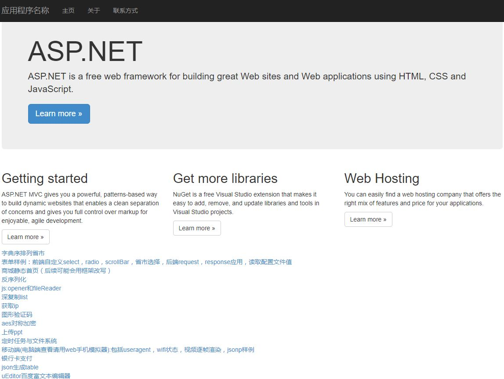
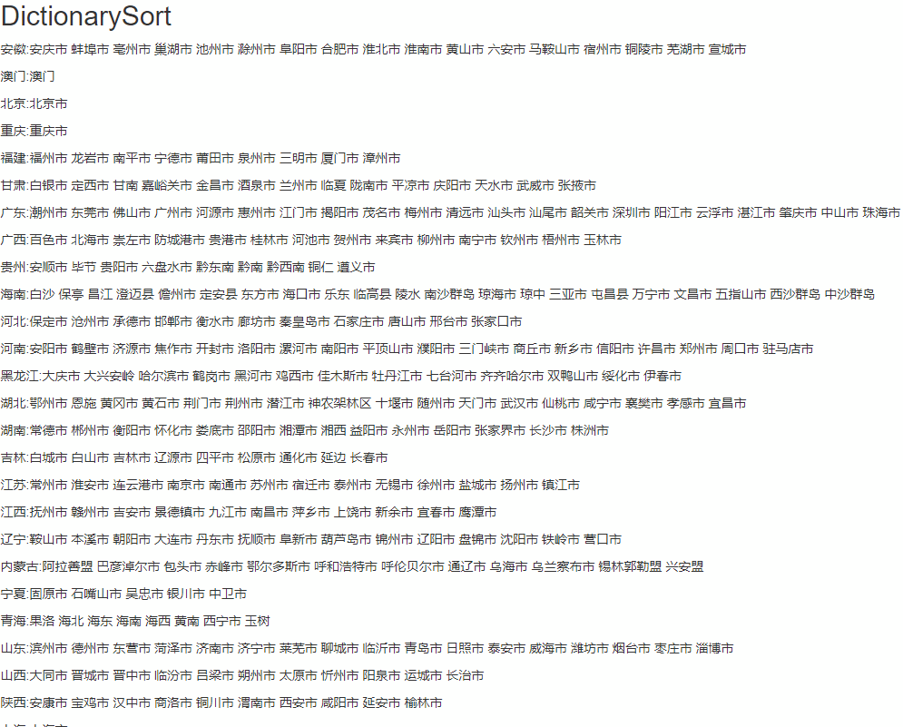
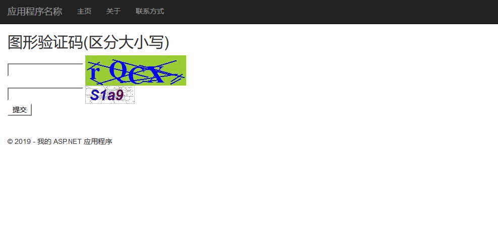
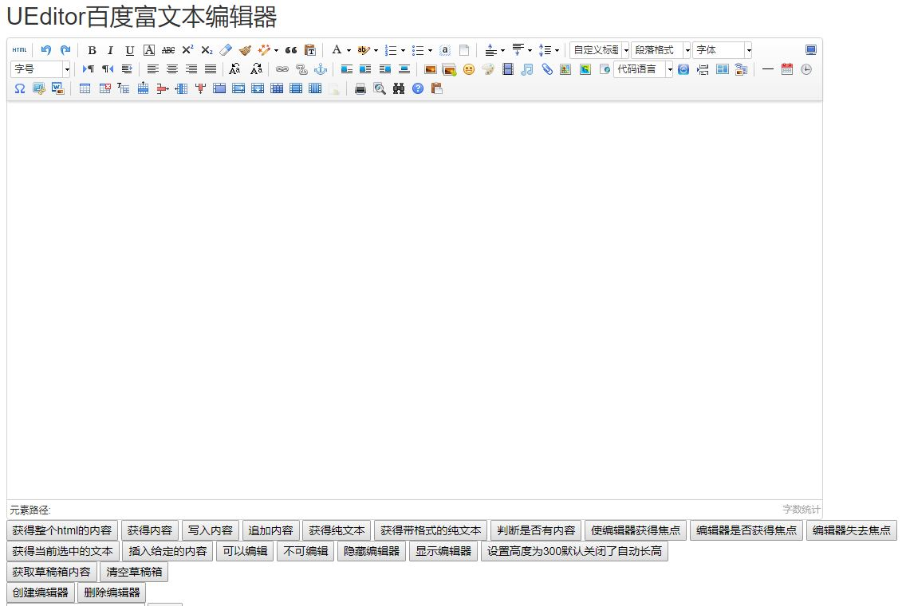
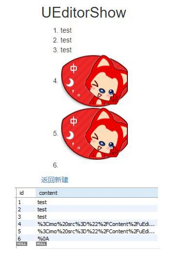

# asp.netExample
通过vs打开

## 功能：
1. urlAdapt
2. 判断userAgent
3. 判断是否Wifi
4. jsonp样例
5. 移动端页面
6. 单元测试
7. ado实体类模型生成mysql entities实体类
8. UnitOfWork通过context对sql增删改查进行封装，并产生数据表仓库上下文repository
9. 数据表仓库利用linq，提供各种方法
10. 静态构造函数
11. 定时任务-quartz
12. 文件系统
13. 文件上传
14. AES对称加密，用于跨域session和cookie
15. 深复制泛型list
16. 获取IP地址
17. 图形验证码
18. 视频canvas ffps
19. opener和fileReader
20. smtp/exchange/mailkit发送邮件
21. 反序列化字符串
22. lucene全文搜索架构
23. 商城静态首页样例（后续可能会用框架改写），自动补全，flex，border-box
24. 表单样例：前端自定义select，radio，scrollBar，省市选择，后端request，response应用
25. 移动端适配：flexible，sass转换dpr，字体，图片函数
26. 省市按字典序排列
27. 银行卡支付
28. json生成table
29. UEditor百度富文本编辑器
30. 生成指定范围不重复随机数
31. 根据链接生成二维码
32. webapi返回文件
33. 在图片上写字
34. 打印日志
35. 解析对象数组

## 期待更多扩展
1. 支付接口：微信、支付宝
2. [pdf导出](https://github.com/RyougiChan/HTML2PDF-netcore)

## 页面效果

1. PC首页:index

2. 字典序排列省市:DictionarySort

3. 图形验证码:imgcode

4. 百度富文本编辑器:uEditor

* 数据库结果

